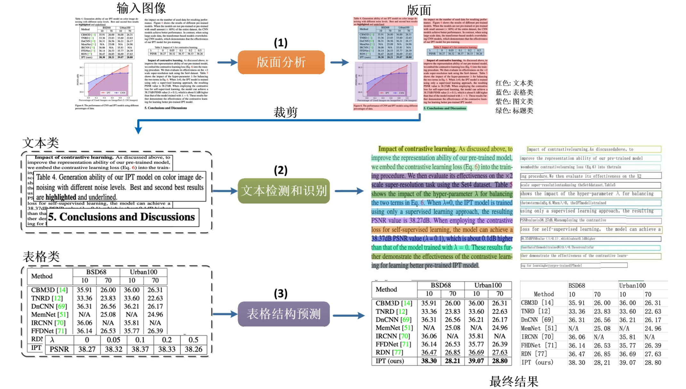
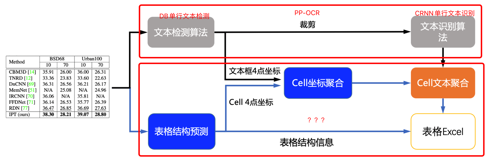
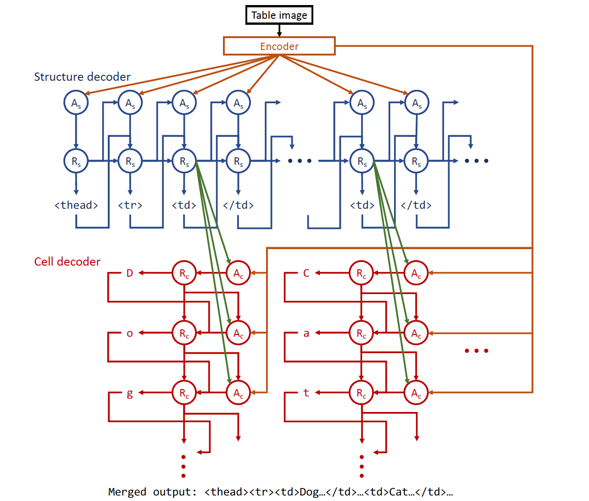
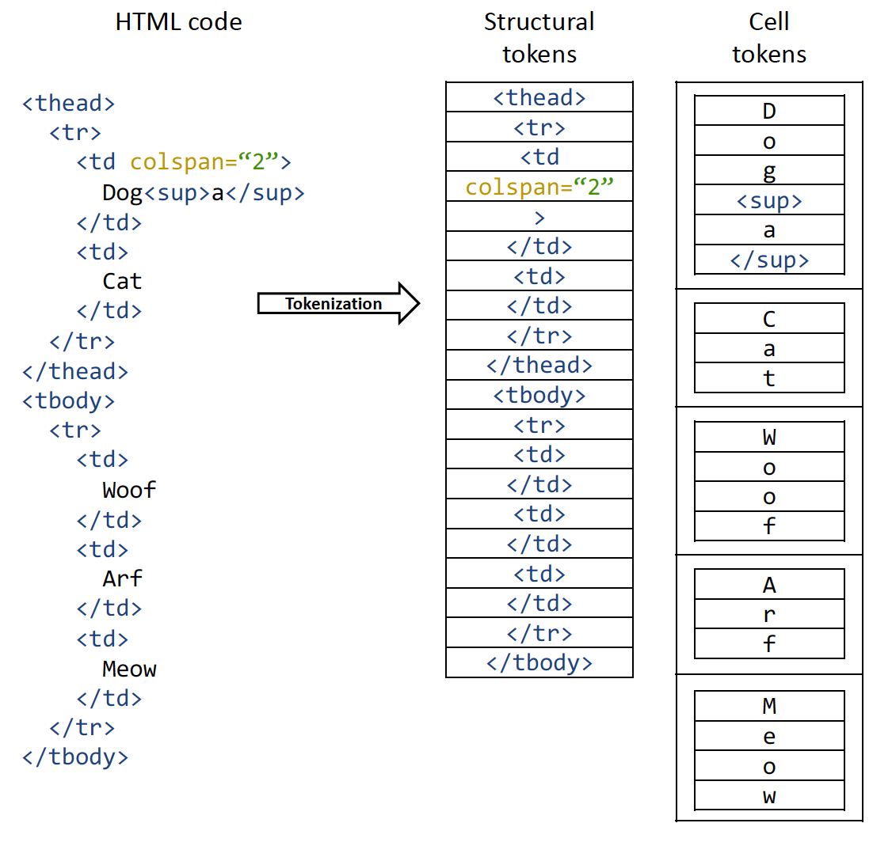
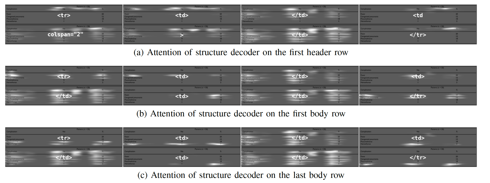
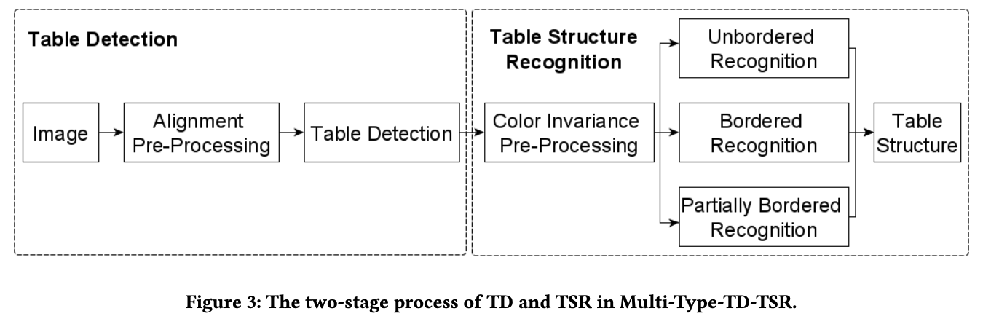
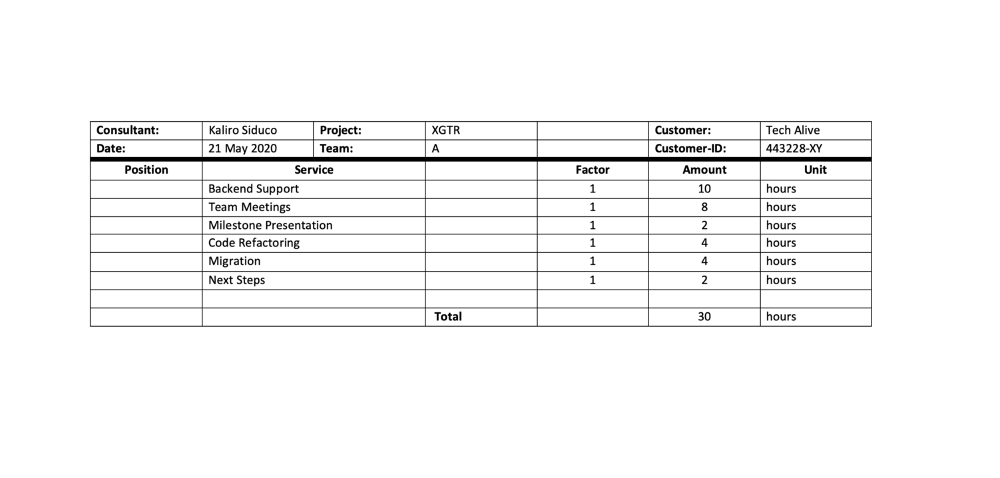
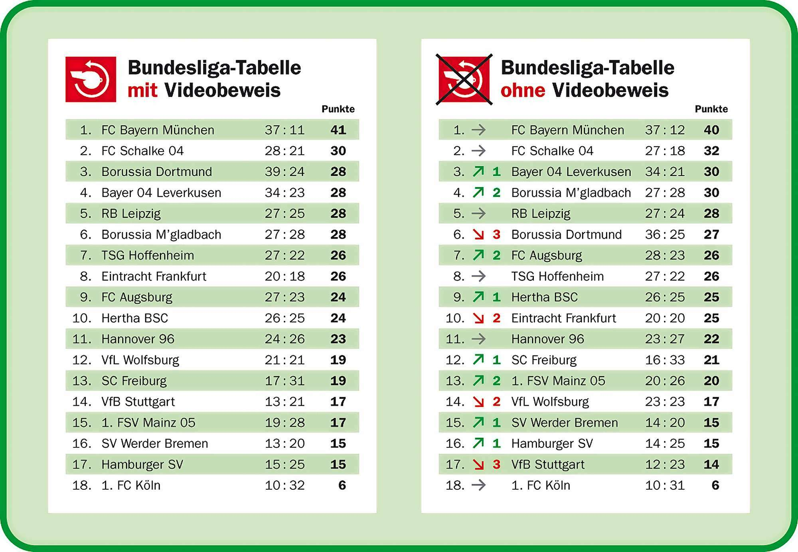
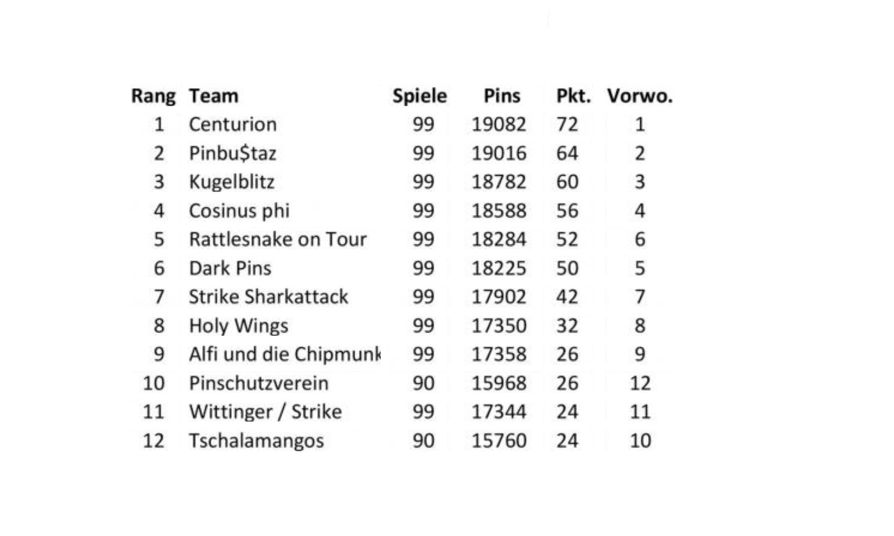
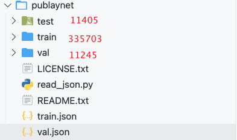

<!-- TOC -->

- [暑期总结](#暑期总结)
- [表格识别](#表格识别)
  - [论文](#论文)
    - [1. PP-Structure（有代码）](#1-pp-structure有代码)
    - [2. EDD（无代码）](#2-edd无代码)
    - [3. 平安银行某团队icdar2021 table recognition to html任务上的解决方案](#3-平安银行某团队icdar2021-table-recognition-to-html任务上的解决方案)
    - [4. Multi-Type-TD-TSR](#4-multi-type-td-tsr)
    - [5. CascadeTabNet](#5-cascadetabnet)
  - [数据集](#数据集)
    - [PubLayNet（已下载）](#publaynet已下载)
    - [TableBank（未下载）](#tablebank未下载)
    - [icdar2013 table](#icdar2013-table)

<!-- /TOC -->

# 暑期总结

1. 跑了一些String Similarity的实验（似乎没什么用）
2. 学了学图，看了看gcn,gat,graphsage等代码（Emmm，还没怎么跑代码）
3. 重写了之前图档整饰的前后端
4. 尝试完善原有的图像整饰(文本方向检测，文档中目标检测的优化)
   1. 文本方向检测
        
        [使用paddleocr进行文本方向的检测](../project_related/use_paddle_text_direction.md)
   2. 文档对象检测的优化

        目标检测的方法肯定会存在一定的误差，就是说形状只能是矩形，就也可能丢失信息或者处理不准确

        想尝试使用实体分割，但是数据集难搞，尝试了百度开源的[EISeg](https://github.com/PaddlePaddle/PaddleSeg/blob/release/2.2/contrib/EISeg/README.md)，实在太卡了，就没弄了

# 表格识别

## 论文

### 1. PP-Structure（有代码）

[代码github库](https://github.com/PaddlePaddle/PaddleOCR/tree/release/2.3/ppstructure)



1.  版面分析
   
    数据集`PubLayNet`，`TableBank`

    基于[PaddleDetection](https://github.com/PaddlePaddle/PaddleDetection)训练，配置文件[参照](https://github.com/PaddlePaddle/PaddleOCR/blob/release/2.3/ppstructure/layout/train_layoutparser_model_ch.md)

2.  表格识别

    数据集`TableBank`

    

    - 图片由单行文字检测模型检测到单行文字的坐标，然后送入识别模型拿到识别结果。
    - 图片由表格结构和cell坐标预测模型拿到表格的结构信息和单元格的坐标信息。
    - 由单行文字的坐标、识别结果和单元格的坐标一起组合出单元格的识别结果。
    - 单元格的识别结果和表格结构一起构造表格的html字符串。

### 2. EDD（无代码）

EDD模型结构（ENCODER-DUAL-DECODER (EDD) MODEL）




Encoder是CNN网络

`A`指的是注意力网络，`R`为RNN单元

使用两个decoder的原因：

1. 表格结构识别与单元格的内容识别是两个完全不同的任务，单个基于注意力的解码器同时解决两个任务是无效的
2. 结构识别任务的信息能够对单元格内容识别的任务有帮助

因此这里需要将HTML Ground Truth 分离为两个



注意力可视化



整体的loss将表示为

$l_s$, $l_c$分为为结构与内容识别的loss，cross-entropy

$l = \lambda l_s + ( 1 - \lambda )l_c$

**TEDS**：TREE-EDIT-DISTANCE-BASED SIMILARITY


使用PaperWithCode查找代码，有提供一个github库，但是好像不是这篇论文的代码，是另外一篇论文的代码，

### 3. 平安银行某团队icdar2021 table recognition to html任务上的解决方案

这个解决方案还没有仔细看，昨天总结EDD的时候发现的。

[pdf链接](https://arxiv.org/pdf/2105.01848.pdf)

[github库](https://github.com/JiaquanYe/TableMASTER-mmocr)

### 4. Multi-Type-TD-TSR

 Multi-stage Pipeline for Table Detection and Table Structure Recognition

[pdf链接](https://arxiv.org/pdf/2105.11021.pdf)

[github库](https://github.com/Psarpei/Multi-Type-TD-TSR)



使用[Detectron2](https://github.com/facebookresearch/detectron2)进行表格检测。后面的步骤基本是使用传统的图像处理方法来处理。

1. 有完整边框

    

2. 有部分边框

    

3. 无边框

    

### 5. CascadeTabNet

[pdf链接](https://arxiv.org/pdf/2004.12629.pdf)

[github库](https://github.com/DevashishPrasad/CascadeTabNet)


## 数据集

### PubLayNet（已下载）



[json format of the Object Detection task of MS COCO](https://cocodataset.org/#format-data)

```
images[{
    "file_name": String,
    "width": int,
    "id": int,
    "height": int,
}]

annotation{
    "id": int, 
    "image_id": int, 
    "category_id": int, 
    "segmentation": RLE or [polygon],
    "area": float, 
    "bbox": [x,y,width,height],   # 矩形标注，适合table detection任务
    "iscrowd": 0 or 1,
}

categories[{
    "id": int, 
    "name": str, 
    "supercategory": str,
}]
```

### TableBank（未下载）

官方公布的地址失效了，有根据github上提供的表单进行申请中

### icdar2013 table 