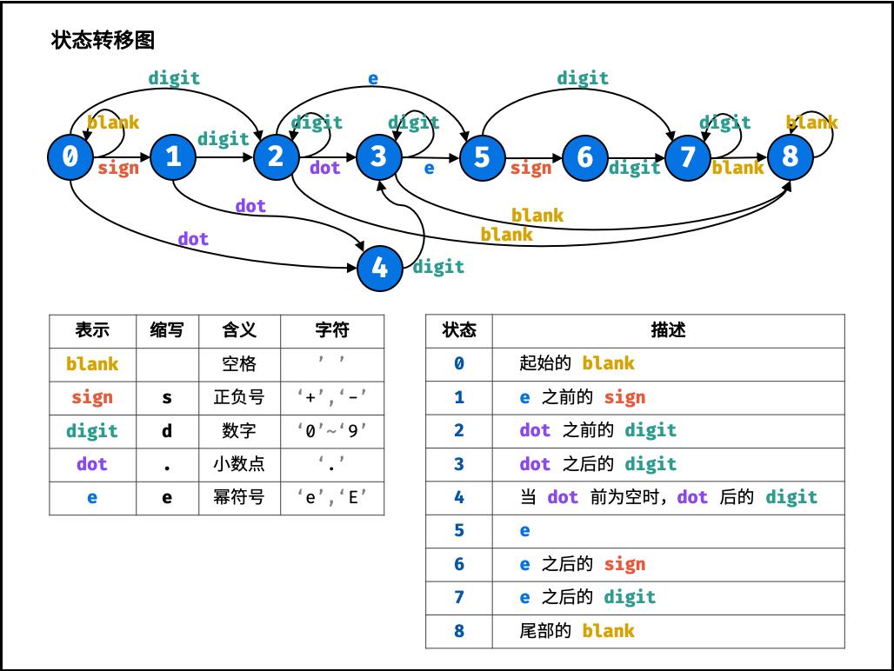

# 题目

请实现一个函数用来判断字符串是否表示数值（包括整数和小数）。

数值（按顺序）可以分成以下几个部分：

    1. 若干空格
    2. 一个 小数 或者 整数
    3. （可选）一个 'e' 或 'E' ，后面跟着一个整数
    4. 若干空格

小数（按顺序）可以分成以下几个部分：

    1. （可选）一个符号字符（'+' 或 '-'）
    2. 下述格式之一：
        1. 至少一位数字，后面跟着一个点 '.'
        2. 至少一位数字，后面跟着一个点 '.' ，后面再跟着至少一位数字
        3. 一个点 '.' ，后面跟着至少一位数字

整数（按顺序）可以分成以下几个部分：

    1. （可选）一个符号字符（'+' 或 '-'）
    2. 至少一位数字

部分数值列举如下：

    ["+100", "5e2", "-123", "3.1416", "-1E-16", "0123"]

部分非数值列举如下：

    ["12e", "1a3.14", "1.2.3", "+-5", "12e+5.4"]

 

示例 1：

输入：s = "0"
输出：true

示例 2：

输入：s = "e"
输出：false

示例 3：

输入：s = "."
输出：false

示例 4：

输入：s = "    .1  "
输出：true

 

提示：

    1 <= s.length <= 20
    s 仅含英文字母（大写和小写），数字（0-9），加号 '+' ，减号 '-' ，空格 ' ' 或者点 '.' 。

# 解答


解题思路：本题使用有限状态自动机。根据字符类型和合法数值的特点，先定义状态，再画出状态转移图，最后编写代码即可。

字符类型：

空格 「 」、数字「 0—90—9 」 、正负号 「 ++, -− 」 、小数点 「 .. 」 、幂符号 「 ee, EE 」 。

状态定义：

按照字符串从左到右的顺序，定义以下 9 种状态。

0. 开始的空格
1. 幂符号前的正负号
2. 小数点前的数字
3. 小数点、小数点后的数字
4. 当小数点前为空格时，小数点、小数点后的数字
5. 幂符号
6. 幂符号后的正负号
7. 幂符号后的数字
8. 结尾的空格

结束状态：合法的结束状态有 2, 3, 7, 8 。


```java
class Solution {
    public boolean isNumber(String s) {
        Map[] states = {
            new HashMap<>() {{ put(' ', 0); put('s', 1); put('d', 2); put('.', 4); }}, // 0.
            new HashMap<>() {{ put('d', 2); put('.', 4); }},                           // 1.
            new HashMap<>() {{ put('d', 2); put('.', 3); put('e', 5); put(' ', 8); }}, // 2.
            new HashMap<>() {{ put('d', 3); put('e', 5); put(' ', 8); }},              // 3.
            new HashMap<>() {{ put('d', 3); }},                                        // 4.
            new HashMap<>() {{ put('s', 6); put('d', 7); }},                           // 5.
            new HashMap<>() {{ put('d', 7); }},                                        // 6.
            new HashMap<>() {{ put('d', 7); put(' ', 8); }},                           // 7.
            new HashMap<>() {{ put(' ', 8); }}                                         // 8.
        };
        int p = 0;
        char t;
        for(char c : s.toCharArray()) {
            if(c >= '0' && c <= '9') t = 'd';
            else if(c == '+' || c == '-') t = 's';
            else if(c == 'e' || c == 'E') t = 'e';
            else if(c == '.' || c == ' ') t = c;
            else t = '?';
            if(!states[p].containsKey(t)) return false;
            p = (int)states[p].get(t);
        }
        return p == 2 || p == 3 || p == 7 || p == 8;
    }
}
```

以上思路来源于leetcode的一个精选解，具体的理解结合一下的图



复杂度分析：

- 时间复杂度 O(N)O(N) ： 其中 NN 为字符串 s 的长度，判断需遍历字符串，每轮状态转移的使用 O(1)O(1) 时间。
- 空间复杂度 O(1)O(1) ： states 和 p 使用常数大小的额外空间。

以上的这个思路我在理解过程中存在很多的疑问，比如说怎么知道我们列举出来所有的状态，以及如何定义状态之间的转移。

这里我理解为主要根据“小数点”前后以及“指数”前后来划分就可以很轻松地找到所有的状态，另外，状态间的转移条件其实就是字符的种类数，有些情况下不需要将所有的字符种类全部列举处出来，因为在某些情况下不满足状态机的一些条件即被“直接拒绝”。

一开始做这个题目的时候，我的想法是找到每个字符之间的相互关系，然后对建立相互关系，但是我不知道怎么使用代码或者抽象一点的模式来表达这种关系，直接看解答之后，才之后这个有限状态机。下面复制leetcode的官方解答对这个“有限状态机”进行解释。

    确定有限状态自动机（以下简称「自动机」）是一类计算模型。它包含一系列状态，这些状态中：

    有一个特殊的状态，被称作「初始状态」。
    还有一系列状态被称为「接受状态」，它们组成了一个特殊的集合。其中，一个状态可能既是「初始状态」，也是「接受状态」。
    起初，这个自动机处于「初始状态」。随后，它顺序地读取字符串中的每一个字符，并根据当前状态和读入的字符，按照某个事先约定好的「转移规则」，从当前状态转移到下一个状态；当状态转移完成后，它就读取下一个字符。当字符串全部读取完毕后，如果自动机处于某个「接受状态」，则判定该字符串「被接受」；否则，判定该字符串「被拒绝」。

    注意：如果输入的过程中某一步转移失败了，即不存在对应的「转移规则」，此时计算将提前中止。在这种情况下我们也判定该字符串「被拒绝」。

    一个自动机，总能够回答某种形式的「对于给定的输入字符串 S，判断其是否满足条件 P」的问题。在本题中，条件 P 即为「构成合法的表示数值的字符串」。

    自动机驱动的编程，可以被看做一种暴力枚举方法的延伸：它穷尽了在任何一种情况下，对应任何的输入，需要做的事情。

    自动机在计算机科学领域有着广泛的应用。在算法领域，它与大名鼎鼎的字符串查找算法「KMP」算法有着密切的关联；在工程领域，它是实现「正则表达式」的基础。

    作者：LeetCode-Solution
    链接：https://leetcode-cn.com/problems/biao-shi-shu-zhi-de-zi-fu-chuan-lcof/solution/biao-shi-shu-zhi-de-zi-fu-chuan-by-leetcode-soluti/
    来源：力扣（LeetCode）
    著作权归作者所有。商业转载请联系作者获得授权，非商业转载请注明出处。

有解答利用正则表达式进行解答，之后再进行补充。