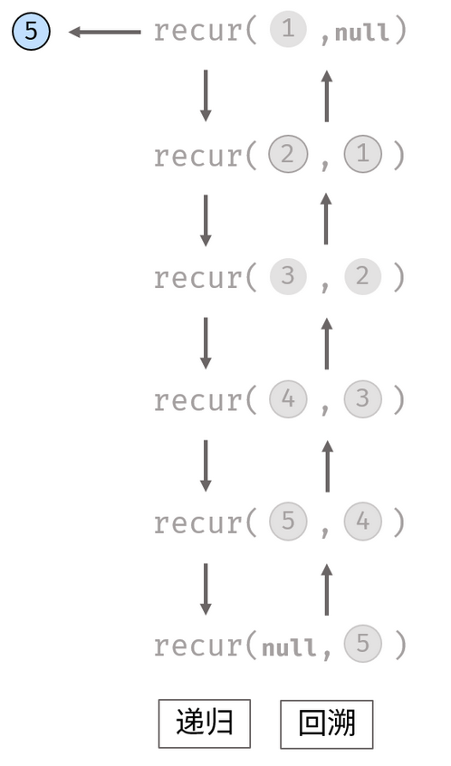

# 题目

定义一个函数，输入一个链表的头节点，反转该链表并输出反转后链表的头节点。

示例:

输入: 1->2->3->4->5->NULL

输出: 5->4->3->2->1->NULL

限制：
0 <= 节点个数 <= 5000

# 解答

```java
public static ListNode reverseList(ListNode head) {
        ListNode current = head;
        ListNode left = null;
        while(current != null){
            ListNode next = current.next;
            current.next = left;
            left = current;
            current = next;
        }

        return left;

        // 递归实现
        // if (head == null || head.next == null) {
        //     return head;
        // }
        // ListNode newHead = reverseList(head.next);
        // head.next.next = head;
        // head.next = null;
        // return newHead;
```

```java
# 递归的另一种实现
public ListNode reverseList(ListNode head) {
    return recur(head, null);    // 调用递归并返回
}
private ListNode recur(ListNode cur, ListNode pre) {
    if (cur == null) return pre; // 终止条件
    ListNode res = recur(cur.next, cur);  // 递归后继节点
    cur.next = pre;              // 修改节点引用指向
    return res;                  // 返回反转链表的头节点
}
```

