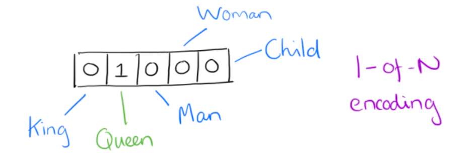

NetWork Embedding是什么?

以社交网络为例，网络嵌入就是将网络中的点用一个低维的向量表示，并且这些向量要能反应原先网络的某些特性，比如如果在原网络中两个点的结构类似，那么这两个点表示成的向量也应该类似。

首先对word2vec的一些思想进行一些梳理

- [1. word2vec](#1-word2vec)
  - [1.1 word2vec](#11-word2vec)
  - [1.2 CBOW](#12-cbow)
  - [1.3 Skip-Gram](#13-skip-gram)
  - [1.4 Hierarchical Softmax (还没仔细看)](#14-hierarchical-softmax-还没仔细看)
  - [1.5 Negative Sampling](#15-negative-sampling)
- [2. DeepWalk](#2-deepwalk)
- [3. LINE：Large-scale Information Network Embedding](#3-linelarge-scale-information-network-embedding)
  - [3.1 新的相似度定义](#31-新的相似度定义)
  - [3.2 优化目标](#32-优化目标)
- [4. Node2vec](#4-node2vec)
  - [4.1 优化目标](#41-优化目标)
  - [4.2 顶点序列采样策略](#42-顶点序列采样策略)
  - [4.3 学习算法](#43-学习算法)
- [5. Struc2vec](#5-struc2vec)
  - [5.1 相似度定义](#51-相似度定义)
  - [5.2 (顶点对)距离定义](#52-顶点对距离定义)
  - [5.3 构建层次带权图](#53-构建层次带权图)
  - [5.4 采样获取顶点序列](#54-采样获取顶点序列)
  - [5.5 优化（还没仔细看）](#55-优化还没仔细看)
- [6. SDNE](#6-sdne)
  - [6.1 相似度定义](#61-相似度定义)
  - [6.2 优化](#62-优化)
  - [6.3 模型结构](#63-模型结构)

# 1. word2vec

[word2vec参考资料](https://zhuanlan.zhihu.com/p/61635013)

word2vec的作用是将单词转化为向量来表示，这样就可以定量地度量词与词之间的关系，从而挖掘词之间的联系。

word2vec之前的词向量表示使用的是One-Hot编码。具体如下图

采用One-Hot编码方式来表示词向量非常简单，但缺点也是显而易见的，一方面我们实际使用的词汇表很大，经常是百万级以上，这么高维的数据处理起来会消耗大量的计算资源与时间。另一方面，One-Hot编码中所有词向量之间彼此正交，没有体现词与词之间的相似关系。

Distributed representation可以解决One-Hot编码存在的问题，它的思路是通过训练，将原来One-Hot编码的每个词都映射到一个较短的词向量上来，而这个较短的词向量的维度可以由我们自己在训练时根据任务需要来自己指定。

下图是采用Distributed representation的一个例子，我们将词汇表里的词用"Royalty","Masculinity", "Femininity"和"Age"4个维度来表示，King这个词对应的词向量可能是(0.99,0.99,0.05,0.7)。当然在实际情况中，我们并不能对词向量的每个维度做一个很好的解释。

有了用Distributed Representation表示的较短的词向量，我们就可以较容易的分析词之间的关系了，比如我们将词的维度降维到2维，有一个有趣的研究表明，用下图的词向量表示我们的词时，我们可以发现：

可见我们只要得到了词汇表里所有词对应的词向量，那么我们就可以做很多有趣的事情了。不过，怎么训练才能得到合适的词向量呢？针对这个问题，Google的Tomas Mikolov在他的论文中提出了CBOW和Skip-gram两种神经网络模型，将在以下说明

## 1.1 word2vec

训练模型本质只具有一个隐藏层的神经元网络，如下图：

输入输出都是One-hot编码的词汇表向量。使用所有的样本，训练这个神经元网络，等到收敛之后，从输入层到隐含层的那些权重，便是每一个词的采用Distributed Representation的词向量。比如，上图中单词的Word embedding后的向量便是矩阵 $W_{V×N}$第i行的转置。这样我们就把原本维数为V的词向量变成了维数为N的词向量（N远小于V），并且词向量间保留了一定的相关关系。

Google的Mikolov在关于Word2Vec的论文中提出了CBOW和Skip-gram两种模型，CBOW适合于数据集较小的情况，而Skip-Gram在大型语料中表现更好。其中CBOW如下图左部分所示，使用围绕目标单词的其他单词（语境）作为输入，在映射层做加权处理后输出目标单词。与CBOW根据语境预测目标单词不同，Skip-gram根据当前单词预测语境，如下图右部分所示。假如我们有一个句子“There is an apple on the table”作为训练数据，CBOW的输入为（is,an,on,the），输出为apple。而Skip-gram的输入为apple，输出为（is,an,on,the）。

## 1.2 CBOW

## 1.3 Skip-Gram

4、通过梯度下降和反向传播更新矩阵W

5、W中的行向量即为每个单词的Word embedding表示

以上是CBOW和Skip-gram最理想情况下的实现，即训练迭代两个矩阵W和W’，之后在输出层采用softmax函数来计算输出各个词的概率。但在实际应用中这种方法的训练开销很大，不具有很强的实用性，为了使得模型便于训练，有学者提出了Hierarchical Softmax和Negative Sampling两种改进方法。

## 1.4 Hierarchical Softmax (还没仔细看)

Hierarchical Softmax对原模型的改进主要有两点，第一点是从输入层到隐藏层的映射，没有采用原先的与矩阵W相乘然后相加求平均的方法，而是直接对所有输入的词向量求和。假设输入的词向量为（0，1，0，0）和（0,0,0,1），那么隐藏层的向量为（0,1,0,1）。

Hierarchical Softmax的第二点改进是采用哈夫曼树来替换了原先的从隐藏层到输出层的矩阵W’。哈夫曼树的叶节点个数为词汇表的单词个数V，一个叶节点代表一个单词，而从根节点到该叶节点的路径确定了这个单词最终输出的词向量。

具体来说，这棵哈夫曼树除了根结点以外的所有非叶节点中都含有一个由参数θ确定的sigmoid函数，不同节点中的θ不一样。训练时隐藏层的向量与这个sigmoid函数进行运算，根据结果进行分类，若分类为负类则沿左子树向下传递，编码为0；若分类为正类则沿右子树向下传递，编码为1。

## 1.5 Negative Sampling

尽管哈夫曼树的引入为模型的训练缩短了许多开销，但对于一些不常见、较生僻的词汇，哈夫曼树在计算它们的词向量时仍然需要做大量的运算。

负采样是另一种用来提高Word2Vec效率的方法，它是基于这样的观察：训练一个神经网络意味着使用一个训练样本就要稍微调整一下神经网络中所有的权重，这样才能够确保预测训练样本更加精确，如果能设计一种方法每次只更新一部分权重，那么计算复杂度将大大降低。

将以上观察引入Word2Vec就是：当通过（”fox”, “quick”)词对来训练神经网络时，我们回想起这个神经网络的“标签”或者是“正确的输出”是一个one-hot向量。也就是说，对于神经网络中对应于”quick”这个单词的神经元对应为1，而其他上千个的输出神经元则对应为0。使用负采样，我们通过随机选择一个较少数目（比如说5个）的“负”样本来更新对应的权重。(在这个条件下，“负”单词就是我们希望神经网络输出为0的神经元对应的单词）。并且我们仍然为我们的“正”单词更新对应的权重（也就是当前样本下”quick”对应的神经元仍然输出为1）。

目前提到图算法一般指：

1. 经典数据结构与算法层面的：最小生成树(Prim,Kruskal,...)，最短路(Dijkstra,Floyed,...)，拓扑排序，关键路径等

2. 概率图模型，涉及图的表示，推断和学习，详细可以参考Koller的书或者公开课

3. 图神经网络，主要包括Graph Embedding(基于随机游走)和Graph CNN(基于邻居汇聚)两部分。

这里先看下Graph Embedding的相关内容。

Graph Embedding技术将图中的节点以低维稠密向量的形式进行表达，要求在原始图中相似(不同的方法对相似的定义不同)的节点其在低维表达空间也接近。得到的表达向量可以用来进行下游任务，如节点分类，链接预测，可视化或重构原始图等。

# 2. DeepWalk

[DeepWalk参考资料1](https://zhuanlan.zhihu.com/p/45167021)

[DeepWalk参考资料2](https://zhuanlan.zhihu.com/p/56380812)

运用在无向图上。

它的输入是一张图或者网络，输出为网络中顶点的向量表示。DeepWalk通过截断随机游走(truncated random walk)学习出一个网络的社会表示(social representation)，在网络标注顶点很少的情况也能得到比较好的效果。并且该方法还具有可扩展的优点，能够适应网络的变化。

DeepWalk的思想类似word2vec，使用图中节点与节点的共现关系来学习节点的向量表示。那么关键的问题就是如何来描述节点与节点的共现关系，DeepWalk给出的方法是使用随机游走(RandomWalk)的方式在图中进行节点采样。

RandomWalk是一种可重复访问已访问节点的深度优先遍历算法。给定当前访问起始节点，从其邻居中随机采样节点作为下一个访问节点，重复此过程，直到访问序列长度满足预设条件。

获取足够数量的节点访问序列后，使用skip-gram model 进行向量学习。

DeepWalk具体的算法流程如下

可以看出，算法主要分为两个步骤，随机游走采样节点序列以及使用skip-gram模型学习节点的向量表达

# 3. LINE：Large-scale Information Network Embedding

[LINE参考资料](https://zhuanlan.zhihu.com/p/56478167)

DeepWalk使用DFS随机游走在图中进行节点采样，使用word2vec在采样的序列学习图中节点的向量表示。

LINE也是一种基于邻域相似假设的方法，只不过与DeepWalk使用DFS构造邻域不同的是，LINE可以看作是一种使用BFS构造邻域的算法。此外，LINE还可以应用在带权图中(DeepWalk仅能用于无权图)。

之前还提到不同的graph embedding方法的一个主要区别是对图中顶点之间的相似度的定义不同，所以先看一下LINE对于相似度的定义。

**LINE算法原理**

## 3.1 新的相似度定义

1. 一阶相似度

1阶相似度用于描述图中成对顶点之间的局部相似度，形式化描述为若 u,v 之间存在直连边，则边权$w_{uv}$即为两个顶点的相似度，若不存在直连边，则1阶相似度为0。 如上图，6和7之间存在直连边，且边权较大，则认为两者相似且1阶相似度较高，而5和6之间不存在直连边，则两者间1阶相似度为0。

2. 二阶相似度

如上图，虽然5和6之间不存在直连边，但是他们有很多相同的邻居顶点(1,2,3,4)，这其实也可以表明5和6是相似的，而2阶相似度就是用来描述这种关系的。 形式化定义为，令$p_u = (w_{u,1},...,w_{u,|V|} )$表示顶点u与所有其他顶点之间的1阶相似度，则u与v的2阶相似度可以通过$p_u$和$p_v$的相似度表示。若u与v之间不存在相同的邻居顶点，则2阶相似度为0

跳转[6.1](#6.1)

## 3.2 优化目标

# 4. Node2vec

[Node2vec参考资料](https://zhuanlan.zhihu.com/p/56542707)

node2vec是一种综合考虑DFS邻域和BFS邻域的graph embedding方法。简单来说，可以看作是deepwalk的一种扩展，是结合了DFS和BFS随机游走的deepwalk。

**算法原理**

## 4.1 优化目标

## 4.2 顶点序列采样策略

**注意：**

这里的$d_{t,x}$ 表示t到x的距离，而这里的概率表示的是从t移动到v节点之后，往x节点移动的概率

## 4.3 学习算法

采样完顶点序列后，剩下的步骤就和deepwalk一样了，用word2vec去学习顶点的embedding向量。 值得注意的是node2vecWalk中不再是随机抽取邻接点，而是按概率抽取，node2vec采用了Alias算法进行顶点采样。

# 5. Struc2vec

[Struc2vec参考资料](https://zhuanlan.zhihu.com/p/56733145)

DeepWalk,LINE,Node2Vec,SDNE几个graph embedding方法。这些方法都是基于近邻相似的假设的。其中DeepWalk,Node2Vec通过随机游走在图中采样顶点序列来构造顶点的近邻集合。LINE显式的构造邻接点对和顶点的距离为1的近邻集合。SDNE使用邻接矩阵描述顶点的近邻结构。

事实上，在一些场景中，两个不是近邻的顶点也可能拥有很高的相似性，对于这类相似性，上述方法是无法捕捉到的。Struc2Vec就是针对这类场景提出的。Struc2Vec的论文发表在2017年的KDD会议中。

**算法原理**

## 5.1 相似度定义

Struc2Vec是从空间结构相似性的角度定义顶点相似度的。

用下面的图简单解释下，如果在基于近邻相似的模型中，顶点u和顶点v是不相似的，第一他们不直接相连，第二他们不共享任何邻居顶点。

而在struc2vec的假设中，顶点u和顶点v是具有空间结构相似的。他们的度数分别为5和4，分别连接3个和2个三角形结构，通过2个顶点(d,e;x,w)和网络的其他部分相连。

直观来看，具有相同度数的顶点是结构相似的，若各自邻接顶点仍然具有相同度数，那么他们的相似度就更高。

## 5.2 (顶点对)距离定义

## 5.3 构建层次带权图

## 5.4 采样获取顶点序列

## 5.5 优化（还没仔细看）

# 6. SDNE

## 6.1 相似度定义

同[3.1](#3.1)

## 6.2 优化

## 6.3 模型结构

