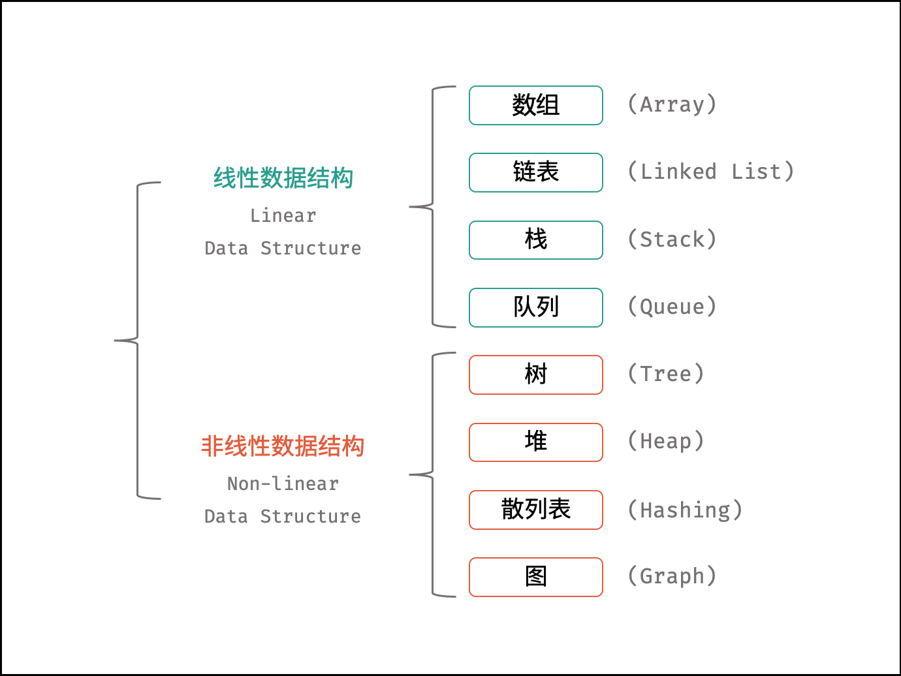
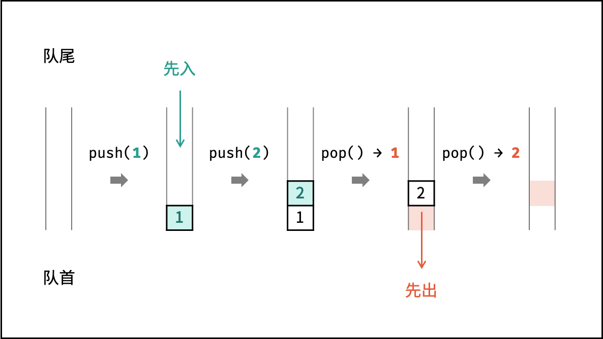
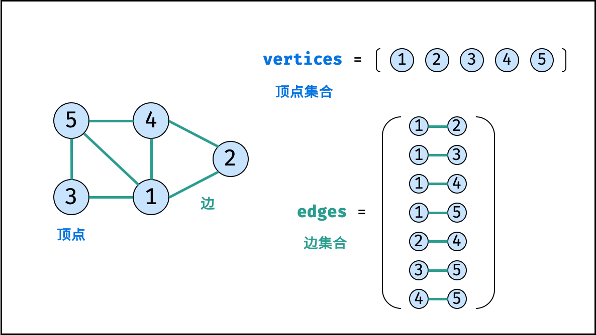

# java一些基础语法的增强学习

## 1 标识符的命名规范

1. 包名：aaa.bbb.ccc 小写字母 .分割
2. 类名：所有单词首字母大写
3. 变量、方法名：第一个单词首字母小写，之后的单词首字母都小写
4. 常量名：AAA_BBB_CCC 全部字母大写，每个单词之间用下划线分割开来

## 2 原码，反码，补码

针对有符号的而言：

1. 二进制的最高位（最左边）是符号位：0表示正数，1表示负数
2. 正数的原码，反码，补码都一样（三码合一）
3. 负数的反码 = 原码符号位不变，其他位取反（0变1，,变0）
4. 负数的补码=反码+1，负数的反码=补码-1
5. 0的反码和补码都是0
6. java没有无符号的数，也就是java中的数都是有符号的
7. 在计算机运算的时候，都是以补码的方式来运算的（可以统一正负数）
8. 我们在看运算结果的时候，要看他的原码

## 3 位运算符

`&`; `|`; `^`;`~`;`>>`;`<<`;`>>>` 按位运算就是按照二进制表示的每一位进行“与或非亦或”运算

注意：没有`<<<`符号


1. 算术右移 >> ：低位溢出，符号位不变，并用符号位补溢出的高位
2. 算术左移 << ：符号位不变，低位补0
3. \>>> 逻辑右移又叫无符号右移，运算规则是：低位溢出，高位补0

```java
int a = 1 >>2; # 0000001 => 00000000 本质是1 / 2 / 2 = 0

int c = 1 <<2; # 0000001 => 00000100 本质是1 * 2 * 2 = 4
```

## 4 数据结构简介

作者：Krahets
链接：https://leetcode-cn.com/leetbook/read/illustration-of-algorithm/50e446/
来源：力扣（LeetCode）
著作权归作者所有。商业转载请联系作者获得授权，非商业转载请注明出处。



### 4.1 数组

```java
int[] array = new int[3];
array[0] = 0;
array[1] = 1;
array[2] = 2;

int[] array_num = {1,2,3,4};
for (int i : array_num){
    System.out.println(i);
}

// 初始化可变数组
List<Integer> array_list = new ArrayList<>();

// 向尾部添加元素
array_list.add(2);
array_list.add(3);
array_list.add(1);
array_list.add(0);
array_list.add(2);
```

### 4.2 链表

```java
class ListNode {
    int val;       // 节点值
    ListNode next; // 后继节点引用
    ListNode(int x) { val = x; }
}

// 实例化节点
ListNode n1 = new ListNode(4); // 节点 head
ListNode n2 = new ListNode(5);
ListNode n3 = new ListNode(1);

// 构建引用指向
n1.next = n2;
n2.next = n3;
```


### 4.3 栈


### 4.4 队列



### 4.5 树

```java
class TreeNode {
    int val;        // 节点值
    TreeNode left;  // 左子节点
    TreeNode right; // 右子节点
    TreeNode(int x) { val = x; }
}

// 初始化节点
TreeNode n1 = new TreeNode(3); // 根节点 root
TreeNode n2 = new TreeNode(4);
TreeNode n3 = new TreeNode(5);
TreeNode n4 = new TreeNode(1);
TreeNode n5 = new TreeNode(2);

// 构建引用指向
n1.left = n2;
n1.right = n3;
n2.left = n4;
n2.right = n5;

```


### 4.5 图

图是一种非线性数据结构，由「节点（顶点）vertex」和「边 edge」组成，每条边连接一对顶点。根据边的方向有无，图可分为「有向图」和「无向图」。本文 以无向图为例 开展介绍。

如下图所示，此无向图的 顶点 和 边 集合分别为：

    顶点集合： vertices = {1, 2, 3, 4, 5}
    边集合： edges = {(1, 2), (1, 3), (1, 4), (1, 5), (2, 4), (3, 5), (4, 5)}



表示图的方法一般都两种

1. 邻接矩阵

使用数组 verticesverticesvertices 存储顶点，邻接矩阵 edgesedgesedges 存储边； edges[i][j]edges[i][j]edges[i][j] 代表节点 i+1i + 1i+1 和 节点 j+1j + 1j+1 之间是否有边。

```java
vertices = [1, 2, 3, 4, 5]
edges = [[0, 1, 1, 1, 1],
         [1, 0, 0, 1, 0],
         [1, 0, 0, 0, 1],
         [1, 1, 0, 0, 1],
         [1, 0, 1, 1, 0]]
```

2. 邻接表

 使用数组 verticesverticesvertices 存储顶点，邻接表 edgesedgesedges 存储边。 edgesedgesedges 为一个二维容器，第一维 iii 代表顶点索引，第二维 edges[i]edges[i]edges[i] 存储此顶点对应的边集和；例如 edges[0]=[1,2,3,4]edges[0] = [1, 2, 3, 4]edges[0]=[1,2,3,4] 代表 vertices[0]vertices[0]vertices[0] 的边集合为 [1,2,3,4][1, 2, 3, 4][1,2,3,4] 。

```java
vertices = [1, 2, 3, 4, 5]
edges = [[1, 2, 3, 4],
         [0, 3],
         [0, 4],
         [0, 1, 4],
         [0, 2, 3]]
```

    邻接矩阵的大小只与节点数量有关，即 N2N^2N2 ，其中 NNN 为节点数量。因此，当边数量明显少于节点数量时，使用邻接矩阵存储图会造成较大的内存浪费。因此，邻接表 适合存储稀疏图（顶点较多、边较少）； 邻接矩阵 适合存储稠密图（顶点较少、边较多）

### 4.6 散列表

散列表是一种非线性数据结构，通过利用 Hash 函数将指定的「键 key」映射至对应的「值 value」，以实现高效的元素查找。


hash函数是可以自己定义的，实际的 Hash 函数需保证低碰撞率、 高鲁棒性等，以适用于各类数据和场景

### 4.7 堆

堆是一种基于「完全二叉树」的数据结构，可使用数组实现。以堆为原理的排序算法称为「堆排序」，基于堆实现的数据结构为「优先队列」。堆分为「大顶堆」和「小顶堆」，大（小）顶堆：任意节点的值不大于（小于）其父节点的值。

```
完全二叉树定义： 设二叉树深度为 kkk ，若二叉树除第 kkk 层外的其它各层（第 111 至 k−1k-1k−1 层）的节点达到最大个数，且处于第 kkk 层的节点都连续集中在最左边，则称此二叉树为完全二叉树。
```

如下图所示，为包含 1, 4, 2, 6, 8 元素的小顶堆。将堆（完全二叉树）中的结点按层编号，即可映射到右边的数组存储形式。


```java
// 初始化小顶堆
Queue<Integer> heap = new PriorityQueue<>();

// 元素入堆
heap.add(1);
heap.add(4);
heap.add(2);
heap.add(6);
heap.add(8);

// 元素出堆（从小到大）
heap.poll(); // -> 1
heap.poll(); // -> 2
heap.poll(); // -> 4
heap.poll(); // -> 6
heap.poll(); // -> 8

```