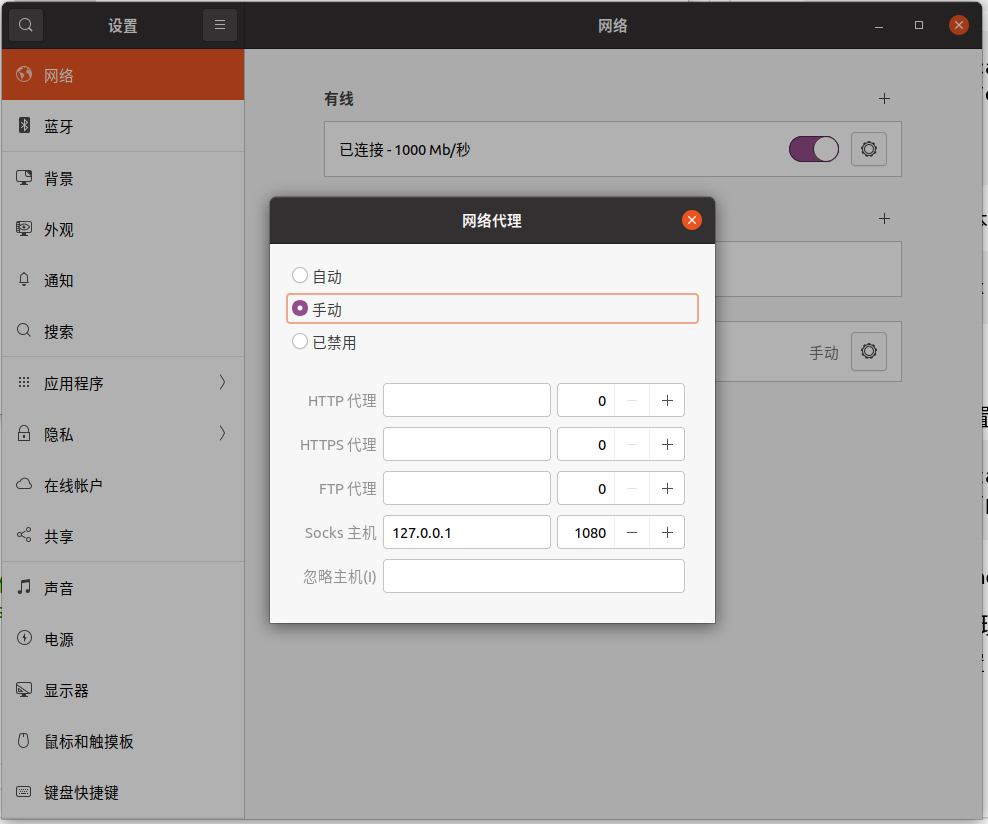

# ubuntu代理的配置

## shadowsocks安装

```shell
sudo apt install python3
sudo apt install python3-pip
sudo python3 -m pip install shadowsocks   #这里默认安装的是shadowsocks2.8.x的客户端   不支持gcm加密方式

# fcm加密方式支持需要3.0.0及其以上版本   可以通过以下命令安装3.0.0版本

python3 -m pip install https://github.com/shadowsocks/shadowsocks/archive/master.zip

```

## shadowsocks配置

```shell
sudo vi /etc/shadowsocks.json
```

参考配置：（具体实验室配置查看有道云笔记实验室配置）
```shell
{
    "server":"server_ip",
    "local_address": "0.0.0.0",
    "local_port":1080,
    "server_port":服务代理端口,
    "password":"代理服务密码",
    "timeout":500,
    "method":"aes-256-gcm",
    "fast_open":false
}
```

## 服务启动

```shell
ssserver -c /etc/shadowsocks.json -d start
ssserver -c /etc/shadowsocks.json -d stop

sslocal -c /etc/shadowsocks.json -d start
sslocal -c /etc/shadowsocks.json -d stop
```

## 自启动设置

```shell
sudo vi /etc/rc.local
```

```shell
# /etc/rc.local
ssserver -c /etc/shadowsocks.json -d start

exit 0
```

从Ubuntu 18.04版本开始，rc.local文件默认不存在。sudo vi /etc/rc.local会创建一个新文件。需要增加文件的可执行权限，重启后才能生效。
```shell
sudo chmod +x /etc/rc.local
```

## 代理配置

### proxychains4配置
```shell
sudo apt install proxychains4 #此命令尽量在原始ubuntu源的基础上执行，国内源似乎阿里源有  不确定
sudo vi /etc/proxychains4.conf #将最后一行改为ss服务的本地端口即可，  socks4改为socks5  如：socks5  127.0.0.1 1080
```
在需要翻墙操作的shell命令添加proxychains4即可

### chrome浏览器代理设置

这里需要去系统设置，网络选项中设置对应的url


在这里配置了网络代理之后，全局的网络都会走这个代理。也就是会走全局模式，国内网站也会走这个代理。PAC模式的配置暂时没有找到解决办法