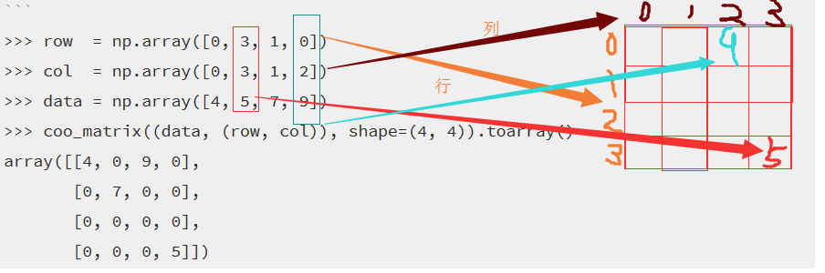

scipy.sparse

在用python进行科学运算时，常常需要把一个稀疏的np.array压缩，这时候就用到scipy库中的sparse.csr_matrix(csr:Compressed Sparse Row marix) 和sparse.csc_matric(csc:Compressed Sparse Column marix)

示例：
```python
import numpy as np
from scipy.sparse import csc_matrix
from scipy.sparse import csr_matrix

indptr = np.array([0, 2, 3, 6])#0表示默认起始点，0之后有几个数字就表示有几行
indices = np.array([0, 2, 2, 0, 1, 2])
data = np.array([1, 2, 3, 4, 5, 6])
tmp = csr_matrix((data, indices, indptr), shape=(3, 3)).toarray()
print(tmp)
```

得到的结果输出：
```shell
[[1 0 2]
 [0 0 3]
 [4 5 6]]
```

其中：indptr参数，0表示默认起始点，0之后有几个数字就表示有几行
data 表示 元数据 显然为1， 2， 3， 4， 5， 6
shape 表示 矩阵的形状 为 3 * 3
indices 表示 各个数据在各行的下标， 从该数据我们可以知道：数据1在某行的0位置处， 数据2在某行的2位置处，6在某行的2位置处。
而各个数据在哪一行就要通过indptr参数得到的
indptr 表示每行数据的个数：[0 2 3 6]表示从第0行开始数据的个数，0表示默认起始点，0之后有几个数字就表示有几行，第一个数字2表示第一行有2 - 0 = 2个数字，因而数字1，2都第0行，第二行有3 - 2 = 1个数字，因而数字3在第1行，以此类推，我们能够知道所有数字的行号


下面以**csc_matrix**为例来看看比较官方的解释：
```python
# 相关变量同上
tmp = csc_matrix((data, indices, indptr), shape=(3, 3)).toarray()
print(tmp)
```

结果输出：
```shell
[[1 0 4]
 [0 0 5]
 [2 3 6]]
```

同理，按col列来压缩，具体解释可以行压缩


coo_matrix

```python
row  = np.array([0, 3, 1, 0])
col  = np.array([0, 3, 1, 2])
data = np.array([4, 5, 7, 9])
coo_matrix((data, (row, col)), shape=(4, 4)).toarray()
print(tmp)
```

