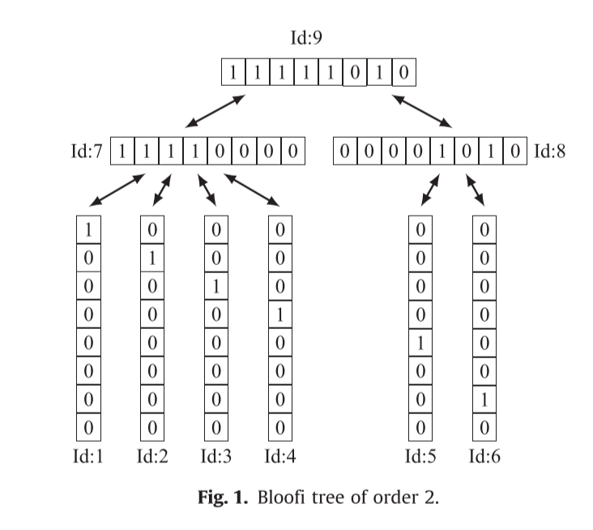

They propose to use a Bloom filter for each document and to arrange them either in a B-tree or as a Flat-Bloofi. The latter is similar to BIGSI and COBS without compaction

Fig. 1 shows an example of a Bloofi index of order 2. Each internal node has between 2 and 4 child pointers. The leaf level of the tree contains the original Bloom filters indexed by the Bloofi index, with identifiers 1, 2, 3, 4, 5, and 6. The node identifiers are shown here for ease ofpresentation, but they are also used in practice during updates and deletes to identify the node that needs to be updated or deleted (see Sections 5.2 and 5.3 for details). In the rest of the paper, we often use “node X” to refer to the node with identifier X. At the next higher level, the values are obtained by applying bitwise OR on the values of the children nodes, so the value of the node 7 is the bitwise OR between values of nodes 1, 2, 3, and 4. The process continues until the root is reached.