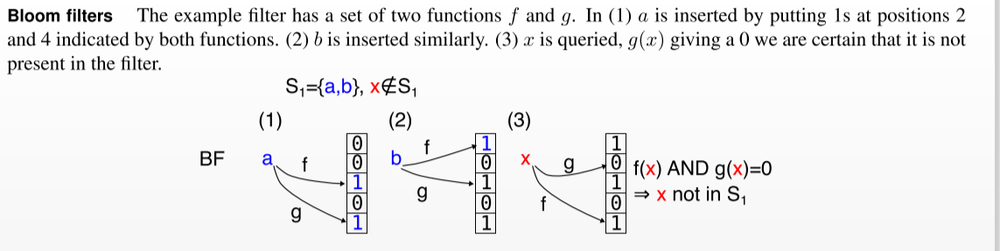
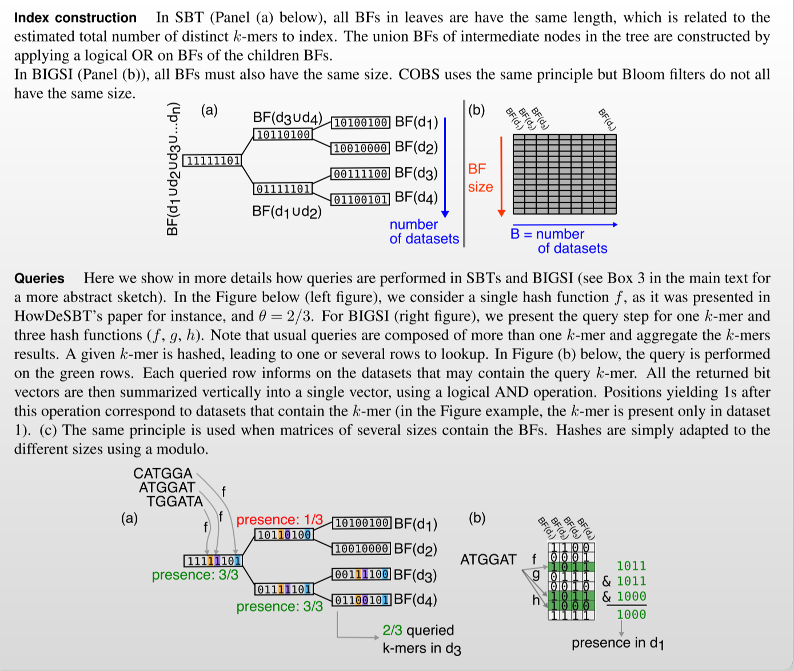
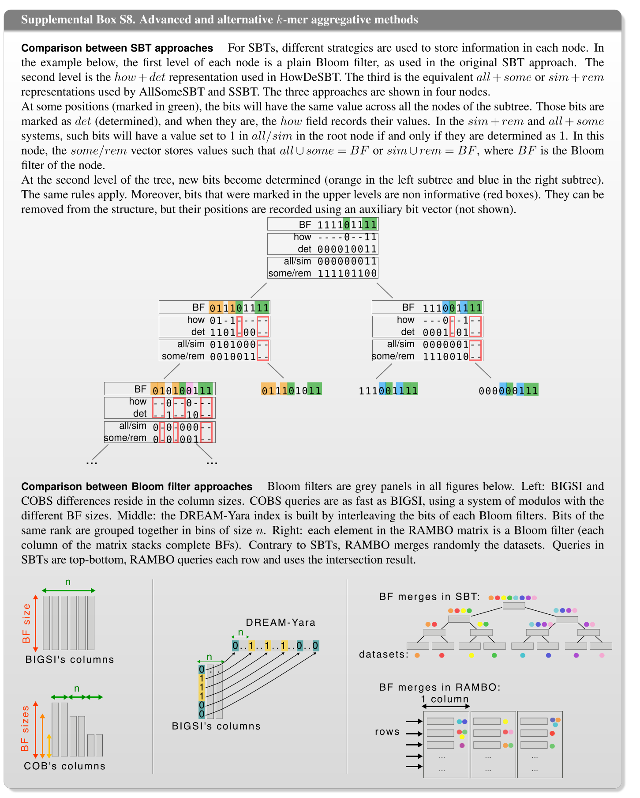

# 1 背景

100000个物种的微生物基因库有$2.2*10^{10}$不同的31-mers([k-mers](#kmers))，有$1.8*10^{10}$只出现过一次，这自然语料库有很大的不同。

另外还有两个方面，搜索生物数据不同于标准文本检索。

* 首先，索引必须支持近似查询，允许检测与查询密切相关的DNA。然而，对于文本索引来说，近似模式匹配是一个众所周知的难题。
* 第二，用户通常想要所有的hits，而不是像网络搜索中典型的那样，只想要前几个hits。

对于COBS，使用了健壮的q-gram(同k-mers)索引方法，并将其与Bloom过滤器相结合，以减小术语空间的大小。这可以被认为是签名文件([sigature-file](#signature-file))的一种变体，签名文件在信息检索方面有着悠久的历史，但被倒排索引([Inverted index](#Invertedindex))推到了文本搜索的边缘。最近，它们被重新考虑作为大型文本搜索语料库的加速过滤器，通过设计它们来适应集合的特征。利用COBS，将Bloom过滤器引入的单边错误的签名文件和反转文件结合起来，设计了一个超快速、可伸缩的q-gram索引，它支持提供少量合理预期误报的近似查询。

贡献在与将签名文件压缩使索引能够应用于具有高度不同文档大小的语料库，例如微生物DNA样本。

# 2 相关工作

* 最早使用Bloom过滤器作为独立文档集合索引的方法是Crainiceanu和Lemire称之为Bloofi([Bloofi-paper](../paper_files/string_similarity/cobs-refs/bloofi.pdf))([bloofi-md](./cobs-refs/bloofi.md))(They propose to use a Bloom filter for each document and to arrange them either in a B-tree or as a Flat-Bloofi. The latter is similar to BIGSI and COBS without compaction)
* 目前被引用最多的DNA k-mer指数近似搜索方法是由Solomon和Kingsford首先提出的序列开花树（[SBT](#sbtandbigsi)）(In an SBT the k-mers of each document are indexed into individual Bloom filters, which are then arranged as the leaves of a binary tree. The inner nodes of the binary tree are union Bloom filters of their descendants. A query can then breadth-first traverse the tree, pruning search paths which no longer sufficiently cover a given threshold Θ of the query k-mers.)
* SBT的改进方法([SBT](#SBTPROCESS))

还有一种完全不同的索引k-mers的方法。使用计数商滤波器（CQF）来构造从k-mers到颜色类的映射。

更多详细相关工作可以参考[这篇综述](./../paper_files/string_similarity/cobs-refs/k-mer_review.pdf)以及其[附录](../paper_files/string_similarity/cobs-refs/k-mer_Supplemental.pdf)

# 3 一种紧凑的分片签名索引(A Compact Bit-Sliced Signature Index)

## 3.1 签名的Bloom滤波器近似匹配(Approximate Matching with Bloom Filters of Signatures)

# 附录

## 什么是 signature file

从存储和查询两个阶段对它进行介绍。

1．存储阶段
对于每个关键字，分配一个固定大小的向量（k-bit），这个向量叫做签名（Signature）；对于一个网页文件，经过词典切分后，形成由对应 关键字序列构成的向量，即P=<key1,key2,…,keym>，对这些关键字的签名做OR运算，就形成了网页文件的签名。这个过程也被 称为重叠编码（Superimposed Coding），然后把网页文件的签名结果依次存入一个个独立的文件中，形成对应的签名文件，这样形成的签名文件比原文件小很多。
例如：有一页网页分词后有这样一些关键字“文本”、“英语”、“单词”、“信件”，假设将这些关键字经某哈希表散列成固定位的数字向量（以6位为 例），分别为hash(文本)=000110，hash(英语)= 110001，hash(单词)= 001101，hash(信件)=000111，这些数字向量即为关键字的签名，然后将这些签名做OR运算，得到网页文件的签名。

2．查询阶段
接受用户查询语句A，首先把用户查询串字符串切分成关键字序列，形成查询向量，即A=<key1,key2,…,keyn>。然后把关键字映射成相应的向量签名，再与网页签名文件进行按位与运算，得到最后的匹配结果。

3．优缺点
签名文件索引方式是一种比较有效的索引机制，文件组织简单，基本和原文件顺序一致；维护容易，生成、插入、删除都很方便；所需空间小，特别是采用重 叠编码之后；实现比较简单，更新比较容易；适合并行处理和分布式存储。但是签名向量的大小选择是一个需要研究的问题，而且对于大的文本文件，必须进行分块 处理，检索速度慢，需要顺序扫描。

##  什么是k-mers

k-mers理解为将字符串解析为set存储。具体"abcdef"字符串的3-mers为{"abc","bcd","cde","def"}

##  什么是倒排索引
举个例子：我们用不同的数字索引不同的句子（比如以下三句在文本中是按照0，1，2的顺序排列的）

0 ： “I love you”

1 ：“I love you too”

2： “I dislike you”

如果要用单词作为索引，而句子的位置作为被索引的元素，那么索引就发生了倒置：

“I” ：{0， 1， 2}

“love” ：{0， 1}

“you” ：{0， 1， 2}

“dislike” ：{2}

如果要检索“I dislike you ”这句话，那么就可以这么计算：$\{0,1,2\}$ $\bigcap$ $\{2\}$ $\bigcap$ $\{0, 1,2\}$

## bloom fliter

## SBT & BIGSI

## SBT改进方法

绿色标记的位表示在子树中拥有相同值的节点，det用来标记这些位的位置，how用来记录这些位的具体值。