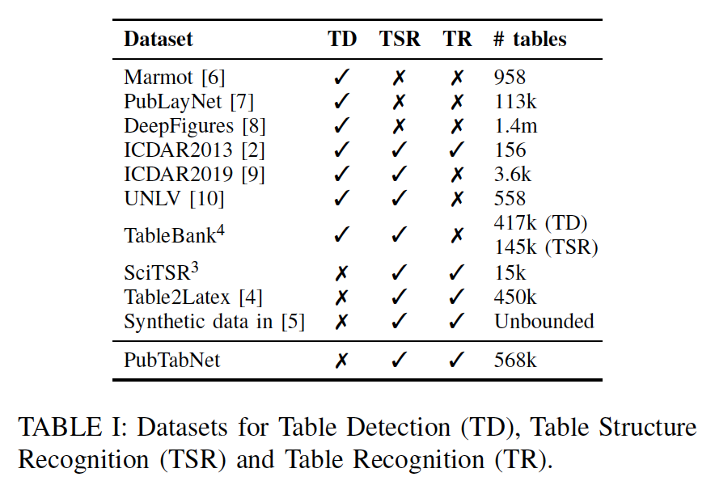
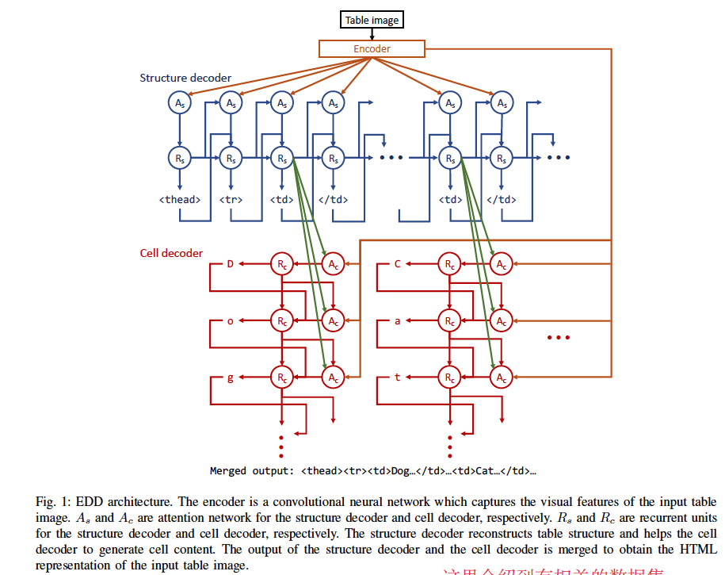
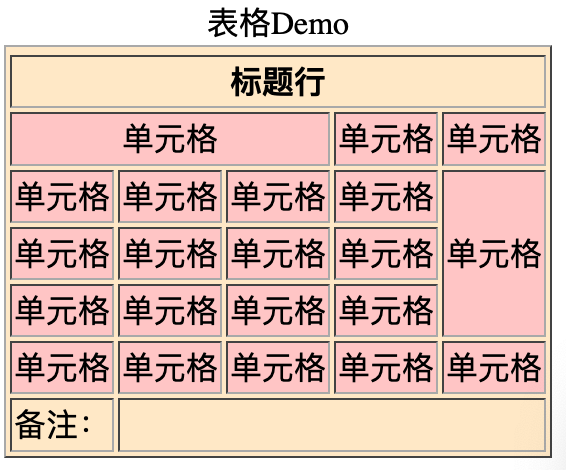

# Image-based table recognition: data, model, and evaluation

[原文在这](../paper_files/table_recognition/EDD.pdf)

以下笔记中涉及到的引用顺序参照原文引用

## 数据相关
非结构化文档中的表格数据分析，主要有三方面：①表格检测（定位）②表格结构识别（单元格的划分）③表格识别（每个单元格内内容的识别）

以下是相关的数据集



<hr>

PubTabNet数据的自动化生成（针对PubTabNet原始数据的处理）

[7]中通过算法将原始数据的XML与PDF文件关联起来，自动生成适用于文档版面分析的PubLaynet数据。

本文作者参照以上的算法，提取文档中的Table节点，并将table转化为分辨率为72 PPI的图像，使用这种低PPI设置来放款模型对高分辨率输入图像的要求。此算法可能会生成错误的边界框，作者使用启发式验证边界框的正确性，对于每一个批注，将从PDF中提取边界框中的文本，并与批注中的文本进行对于，若两个文本的tf-idf特征的余弦相似度 > 90%，且两个文本的长度差异 < 10%，则认为边界框正确。同时，作者为了提高数据的可学习性，删除了一些表，如跨域10行或者10列以上的表格、所有表中出现次数小于50次的字符、注释中包含的数字和内联公式的表。因为这些内容没有一致的XML表示。

其他工作：统一标签，去除表格多余属性，td节点中除“rowspan”和“colspan”之外的所有属性都被剥离

## model相关

传统的表格识别方法依赖于预定义规则以及statistical machine learning。最新的是在图像的基础上应用深度学习技术对表格进行检测与结构的识别。

FCN、Faster-RCNN、Mask-RCNN、YOLO等工作在“目标检测”方面对表格进行检测。同时也有使用图神经网络[7,29-31]的将文档图片编码成图来进行表格的检测与结构识别工作。

EDD模型架构如下图




# 附录

## 网页table示例代码

```html
<!DOCTYPE html>
<html lang="en">
<head>
    <meta charset="UTF-8">
    <title>表格Demo</title>
</head>
<body>
    <table border="1" bgcolor="#FFEBCD">
    <thead>
        <caption>表格Demo</caption>
        <tr><th colspan="5" align="center">标题行</th></tr>
    </thead>
    <tbody style="background: #FFCCCC">
        <tr><td colspan="3" align="center">单元格</td><td>单元格</td><td>单元格</td></tr>
        <tr><td>单元格</td><td>单元格</td><td>单元格</td><td>单元格</td><td rowspan="3">单元格</td></tr>
        <tr><td>单元格</td><td>单元格</td><td>单元格</td><td>单元格</td></tr>
        <tr><td>单元格</td><td>单元格</td><td>单元格</td><td>单元格</td></tr>
        <tr><td>单元格</td><td>单元格</td><td>单元格</td><td>单元格</td><td>单元格</td></tr>
    </tbody>    
    <tfoot>
        <tr><td>备注：</td><td colspan="4" align="center"></td></tr>
    </tfoot>    
    </table>
</body>
</html>
```
效果展示

