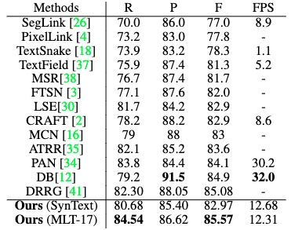

# 1. 原来方案的总结

针对一些版面比较固定的档案图片进行试验，将图片分为三类：证书、证本、证卡，具体如下图

证书：


证本：


证卡：


针对每一类不同的图片会有不同的规则进行处理，也就是说我们需要对每一类图片总结一类规则。

总体的一个过程可以归纳为：

1. 使用paddleocr库进行识别，可以得到档案图像中`文本位置`与`文本内容`
2. 针对不同类别的图片，会有不同的文本相对位置，根据文本的相对位置，尝试性地对文档进行恢复。如针对上图中的证书类图片，可以恢复成以下文本：
```text
安全生产考核合格证书
姓名：李喜和
性别：男
......
```
3. 恢复成以上的文档之后，可以通过正则表达式就可以提取相应内容。

以上过程对文档的相对位置要求极高，也就是说如果同类文档中的相对位置偏离太大，可能导致以上恢复的文档顺序很乱，对正则化提取会造成很大的影响。如在证本图片上就会出现很大的偏差。

这种方法将会造成调参的工足量很大，因此考虑加入文本的语义信息，因此通过下载bert预训练模型，计算两个文本框之间的相似度，通过位置以及文本相似度两者的加权来文本的相关度，从而达到“性别”“男”的提取目的。

## 总结

原有方案不具有通用性，原有的代码只能适应这三类图片，同时如果图片不是很规整，也会对提取的效果造成很大的影响，另外，此方案只是对paddleocr的结果进行后处理，与文档结构复原与文档内容提取还存在一定的距离。

# 2. PPOCR新开源PP-Structure

PP-Structure是一个可用于复杂文档结构分析和处理的OCR工具包，主要特性如下：

* 支持对图片形式的文档进行版面分析，可以划分文字、标题、表格、图片以及列表5类区域（与Layout-Parser联合使用）
* 支持文字、标题、图片以及列表区域提取为文字字段（与PP-OCR联合使用）
* 支持表格区域进行结构化分析，最终结果输出Excel文件
* 支持python whl包和命令行两种方式，简单易用
* 支持版面分析和表格结构化两类任务自定义训练

## 2.1 对其简单测试

查看其Readme可以发现，PP-Structure分为两个部分：版面分析以及表格识别。

版面分析结果如下图:


同时针对以上的三类图片进行了测试，标注出来的全部被识别出来的`Figure`，查看Readme可知`模型基于PaddleDetection 训练`，因此处理自己的数据需要进行针对的训练。

针对以上三类图片表格识别的结果，都很差。以上三类图片其实都是表格类图片，只是没有的表格框，如下是提供的测试图片




## 2.2 思考

版面分析对文档结构进行复原

表格识别可以对图片中存在的表格进行结构识别以及内容重构。

**有点兴趣**