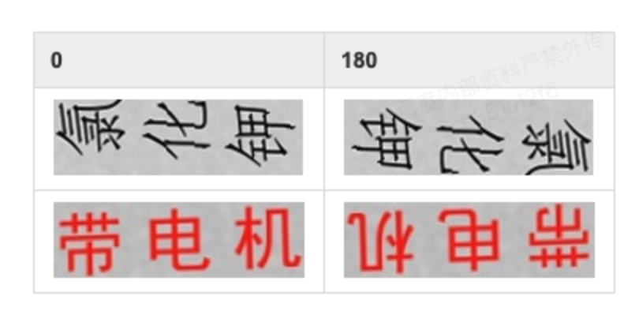
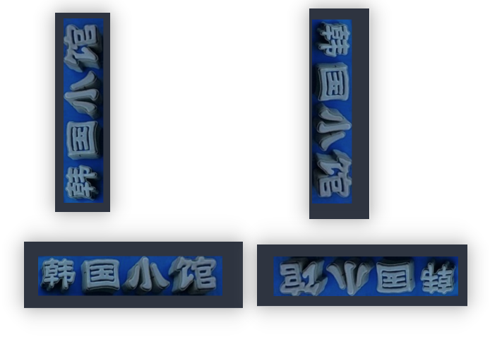

想使用paddleocr中文本检测和方向分类器来进行文本图片的角度获取，失败了，原因很简单，看下面的两张图片

百度官方的分类器示意图


我们测试的一些场景图片


```python
from paddleocr import PaddleOCR, draw_ocr
import cv2

# 思路

# 统计所有识别置信度大于0.9的文本框的宽高比，即统计横竖文本框的个数
# 截取识别置信度最大的文本框，对其进行方向分类，根据返回值0,180 来确定其角度


# 预期结果
# ↑ → 0
# ↓ ← 180

# 试验发现不是上述那样子的

ocr = PaddleOCR(use_angle_cls=True)  # need to run only once to download and load model into memory
img_path = './pics/33.jpg'
temp_box_path = './pics/temp.jpg'

heng = 0 
shu = 0
angle_result = 0

result = ocr.ocr(img_path, det=True, rec=True, cls=True)

heng_max_conf_box = [0, 0, 0, 0] # 横文本框的坐标
heng_max_conf = 0 #横文本框的最大识别置信度
shu_max_conf_box = [0, 0, 0, 0]
shu_max_conf = 0
for line in result:
    xyxy = line[0]
    confidence = line[1][1]

    left_up_x = xyxy[0][0]
    left_up_y = xyxy[0][1]

    right_down_x = xyxy[2][0]
    right_down_y = xyxy[2][1]

    if confidence > 0.9:
        ratio = (right_down_x - left_up_x) / (right_down_y - left_up_y) * 1.0
        if(ratio > 10):
            heng +=1
            if max(confidence, heng_max_conf) == confidence:
                heng_max_conf = confidence
                heng_max_conf_box = [left_up_x, left_up_y, right_down_x, right_down_y]
        elif(ratio < 0.1):
            shu +=1
            if max(confidence, shu_max_conf) == confidence:
                shu_max_conf = confidence
                shu_max_conf_box = [left_up_x, left_up_y, right_down_x, right_down_y]
    else:
        continue
img_text_box = cv2.imread(img_path)

heng_max_conf_box = list(map(int, heng_max_conf_box))
shu_max_conf_box = list(map(int, shu_max_conf_box))


if heng > shu:
    img_text_box = img_text_box[heng_max_conf_box[1]:heng_max_conf_box[3], heng_max_conf_box[0]:heng_max_conf_box[2]]
    cv2.imwrite(temp_box_path, img_text_box)
    direction_result = ocr.ocr(temp_box_path, det=False, rec=False, cls=True)
    print(direction_result)
    if(direction_result[0][0] == '0'):
        angle_result = 270
    else:
        angle_result = 90
else:
    img_text_box = img_text_box[shu_max_conf_box[1]:shu_max_conf_box[3], shu_max_conf_box[0]:shu_max_conf_box[2]]
    cv2.imwrite(temp_box_path, img_text_box)
    direction_result = ocr.ocr(temp_box_path, det=False, rec=False, cls=True)
    print(direction_result)
    if(direction_result[0][0] == '0'):
        angle_result = 0
    else:
        angle_result = 180

# print(angle_result)
# print(heng, heng_max_conf, heng_max_conf_box)
# print(shu, shu_max_conf, shu_max_conf_box)
    
    

# 显示结果
# from PIL import Image

# image = Image.open(img_path).convert('RGB')
# im_show = draw_ocr(image, result, txts=None, scores=None, font_path='/path/to/PaddleOCR/doc/fonts/simfang.ttf')
# im_show = Image.fromarray(im_show)
# im_show.save('result.jpg')
```